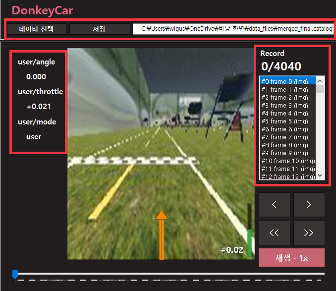
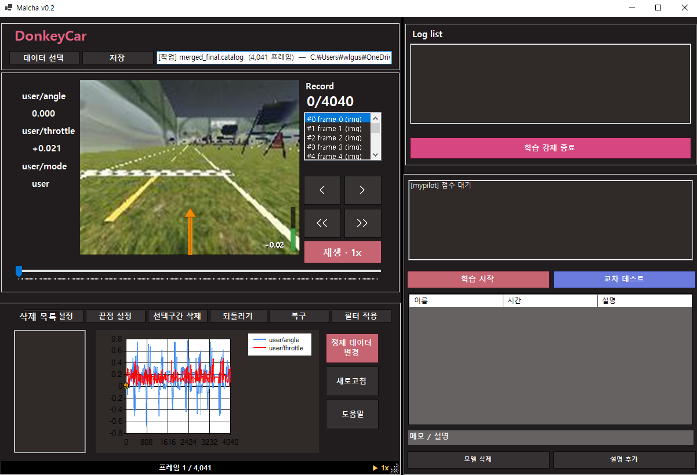
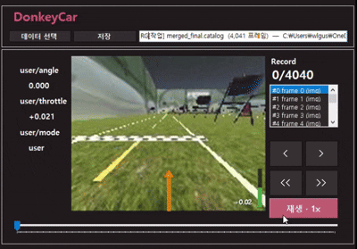
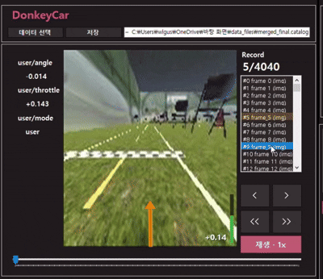
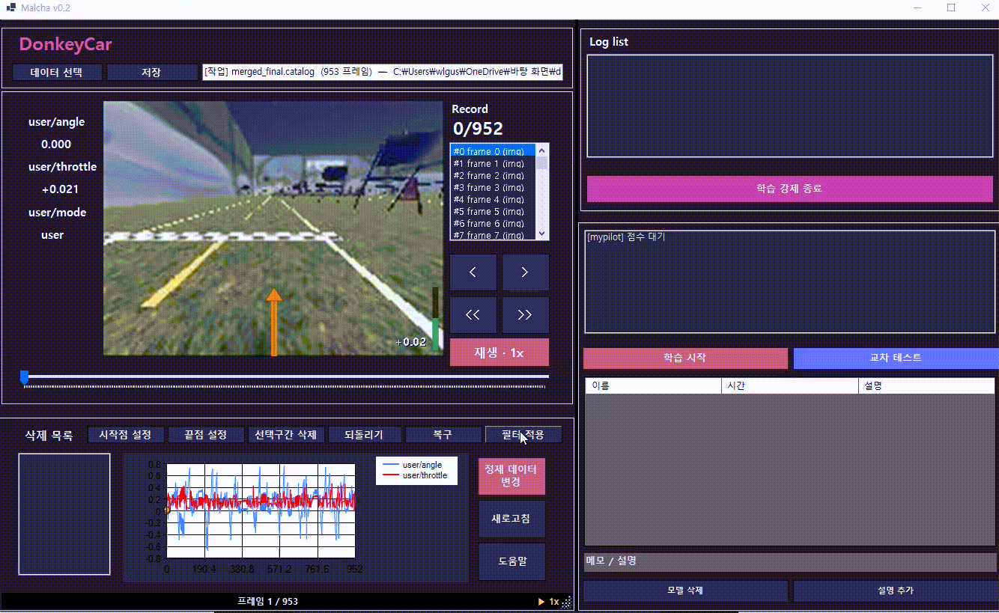
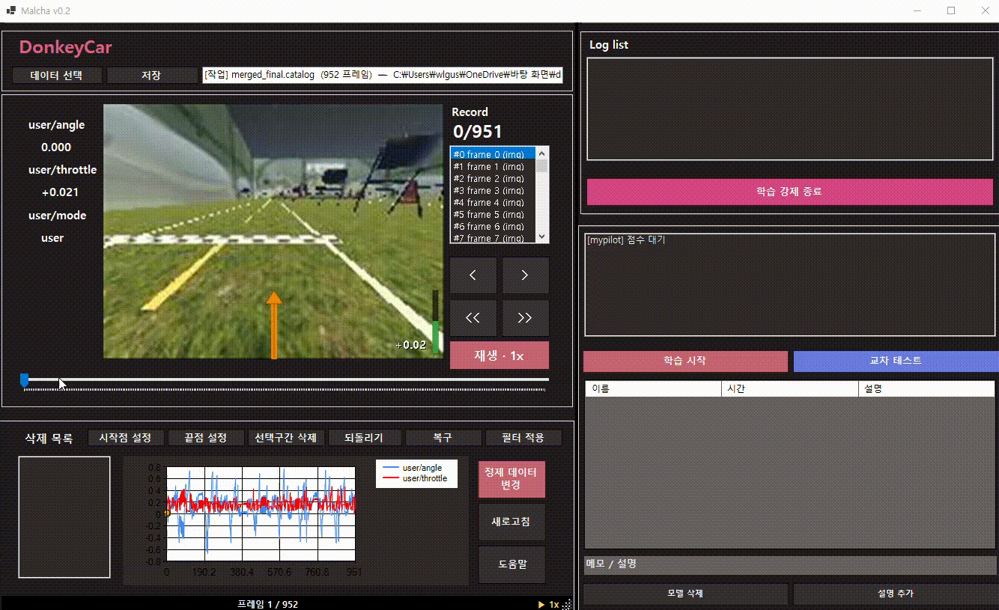
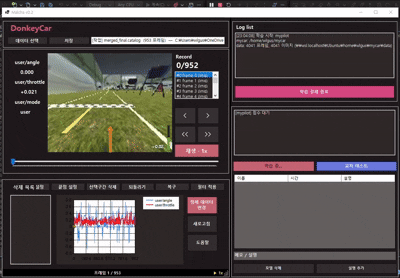
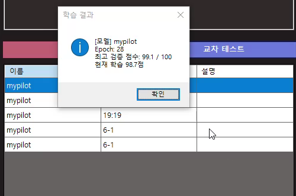
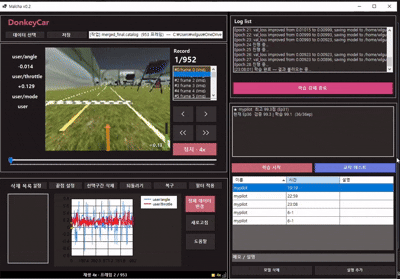
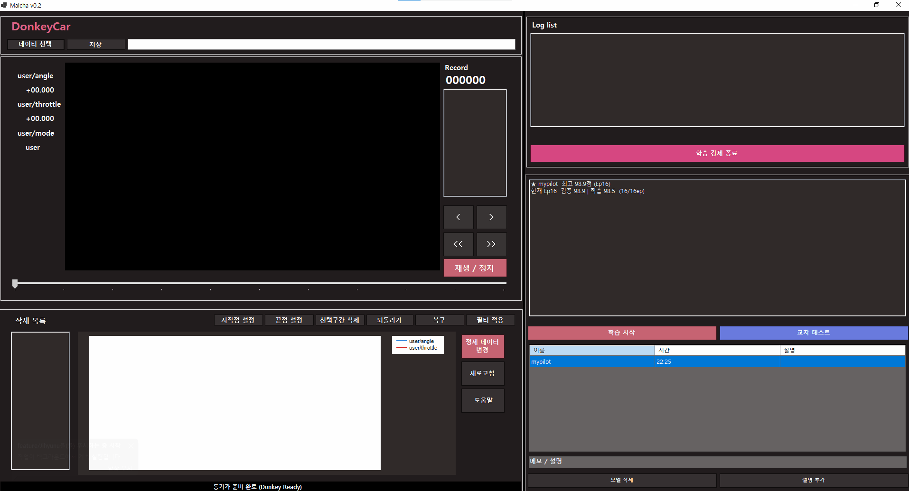

# 🚗 Malcha (말차) - 자율주행 동키카 학습 데이터 정제 및 관리 시스템

> **"C# WinForm과 WSL을 연동한 대용량 자율주행 학습 데이터 정제 및 Time-Machine 백업 복구 플랫폼"**

 

## 📌 1. 프로젝트 배경 및 목표 (Motivation & Goal)
* **배경:** 기존 자율주행 동키카(DonkeyCar) 시스템은 주행 데이터(Tub/Catalog)에 섞인 노이즈(정지 상태, 쓰레기 데이터)를 정제하기 어렵고, 딥러닝 학습 과정이 리눅스 CLI 환경에 종속되어 있어 직관적인 조작이 불가능했습니다.
* **목표:** 사용자 친화적인 C# WinForm UI를 통해 수만 장의 프레임과 이미지를 시각적으로 모니터링하고, 논리적이고 안전하게 정제(Filter)하며, 윈도우 환경에서 클릭 한 번으로 WSL(리눅스 서브시스템)과 연동해 자율주행 모델을 학습시킬 수 있는 통합 툴 생성을 목표로 합니다.

 

## 🏗️ 2. 시스템 설계 및 아키텍처 (Architecture & SE)

### 2.1 핵심 아키텍처 패턴 (MVC 기반 Layered Architecture)
Malcha 프로젝트는 UI(View), 조율자(Controller), 비즈니스 로직(Service/Domain)을 철저히 분리하여 설계되었습니다.
* **Controller**: `CatalogEditorController`, `TrainingController` (화면 제어 및 흐름 통제)
* **Service**: `CatalogService`, `WslDataSyncService` (프레임 병합, 정제, WSL 명령 전달)
* **Model/Data**: 인메모리 스냅샷(Undo), `CatalogMerger` 등 순수 도메인 로직 처리

### 2.2 핵심 유스케이스 (Core Use Cases)
1. **[다중 카탈로그 병합 및 시각화]**: 폴더 형태의 N개의 분할된 데이터(catalog_0, catalog_1)를 `merged_final`이라는 단일 마스터 카탈로그로 병합 후, 차트(조향/쓰로틀)와 타임라인으로 랜더링.
2. **[Time-Machine 스냅샷 백업 및 롤백 복구]**: 필터 정제 시 발생하는 데이터 손실을 막기 위해 가벼운 인메모리(RAM) Undo(`Ctrl+Z`)를 제공하고, 명시적 저장 시 하드디스크에 시간별 백업을 저장. 사용자는 언제든 다이얼로그를 통해 "과거 시점"을 지정하여 즉각 복구 가능.
3. **[WSL 연동 데이터 훈련]**: 윈도우 환경에서 버튼 하나로 WSL 환경의 파이썬 스크립트(`train.py`)를 호출하여 AI 모델을 훈련시키고 실시간으로 Loss 그래프를 확인.

 

## ✨ 3. 주요 기능 (Key Features)

* **프레임 정제 필터 (Frame Refinement Filter)**
  * 주행 중 의미 없는 데이터(쓰로틀이 너무 낮거나 조향이 없는 정지 프레임 등)를 감지하여 일괄 삭제하는 알고리즘 제공.
* **시점 선택 복구 시스템 (Time-Machine Recovery)**
  * 백업 파일 목록을 스캔하여 사용자가 직접 다이얼로그에서 과거 특정 시점(ex. 2026-05-30 오전 10:00 백업본)을 선택해 안전하게 통째로 롤백할 수 있는 강력한 기능.
* **WSL 실시간 학습 진행률 로깅**
  * WSL 파이썬 프로세스를 호출한 뒤, 파이프(Pipe) 통신을 통해 Epoch 별 손실률(Loss) 로그를 실시간으로 파싱하여 WinForm 차트(`TrainingEpochDisplay`)에 아날로그하게 그려줌.

 

## 🛠️ 4. 트러블슈팅 및 기술적 의사결정 (Trouble Shooting)

### 🚨 Issue 1: 대용량 데이터 필터링 시 UI 프리징 및 I/O 오버헤드 문제
* **원인:** 초기에는 필터를 돌리거나 프레임을 1장 삭제할 때마다 즉시 디스크에 Auto-backup을 남기고 파일을 덮어쓰도록 설계하여 병목(I/O 프리징) 발생.
* **해결 과정:**
  1. 저장 전까지는 순수하게 인메모리(RAM) 스택 자료구조 위주로 스냅샷을 쌓는 시스템(Undo)을 메인으로 사용.
  2. 디스크 백업은 사용자가 명시적으로 '저장' 버튼을 누를 때 1회만 스냅샷을 생성하도록 백업 정책 변경.
* **결과:** 사용자 체감 속도 비약적 향상 및 디스크 수명(SSD 쓰기 양) 보호, 쓸모없는 찌꺼기 백업 파일 양산 방지.

### 🚨 Issue 2: 과거 데이터와 현재 데이터의 혼종(Merge) 발생 문제
* **원인:** 초기 백업 복구 로직(`CatalogMerger`)이 현재 망가진 데이터와 옛날 백업 데이터를 비교하여 빈 자리를 채워 넣는(Merge) 병합 방식으로 동작하여, 돌아가고 싶은 과거 시점 100% 그대로 롤백되지 않음.
* **해결 과정:** 과거 데이터와 현재 데이터를 섞어버리는 `MergeWithBackupAsync` 대신, 사용자가 [복구] 시점을 선택하면 해당 옛날 파일 자체를 `LoadCatalogFileAsync`로 읽어와 메모리에 통째로 '덮어씌우는(Overwrite)' 로직으로 재설계.
* **결과:** 소프트웨어 공학의 Undo/Redo 철학에 맞는 올바르고 안전한 '시점 선택 롤백' 달성.

#  ----아래 추가된 READ ME----

## 🚀 ?. 빠른 시작 가이드 (Quick Start: 학습 준비 순서)
Malcha를 활용한 동키카 데이터 정제 및 학습은 아래의 표준 워크플로우를 따름.

### 📋 단계별 프로세스

* **1.데이터 선택:** 데이터 선택 버튼을 클릭하여 주행 .catalog 파일을 열기.

* **2.수동 정제 (선택 사항):** 선택구간 삭제 기능을 활용하여 불필요한 주행 구간이나 노이즈를 수동으로 편집. (복구가 필요한 경우 되돌리기 사용)

* **3.필터 적용:** 필터 적용 버튼을 눌러 중복 프레임, 조향 스파이크, 범위를 초과하는 이상치를 자동으로 정제. (보통 1회 실행으로 충분.)

* **4.정제 데이터 연동 (학습 전 필수):** 정제된 카탈로그와 이미지를 WSL mycar/data 폴더로 동기화.

  (주의: 이 과정을 거치지 않으면 WSL에 남아있는 예전 데이터로 학습이 진행.)

* **5.학습 시작:** 학습 시작 버튼을 눌러 WSL에서 train.py를 실행합니다. (최초 실행 시 mycar 폴더 경로 지정이 필요.)

## 🛠️ 구현한 기능

### 전체 진행 로드맵

#### 1단계: 데이터 읽기

- catalog 파일 선택
- JSON 데이터 파싱
- 데이터 리스트 생성

#### 2단계: 이미지 표시

- 현재 프레임 이미지 로드
- 화면에 이미지 출력

#### 3단계: 프레임 이동

- 이전/다음 프레임 이동
- 현재 인덱스 갱신

#### 4단계: 리스트 선택

- 프레임 목록 표시
- 선택한 프레임으로 이동

#### 5단계: 데이터 필터링

- 조건별 데이터 조회
- 필터 결과 표시

#### 6단계: 데이터 삭제

- 선택 데이터 삭제
- 리스트 갱신

#### 7단계: 학습 실행

- 학습 프로세스 실행
- 진행 상태 표시

#### 8단계: 그래프

- 학습 결과 시각화
- 그래프 출력

#### 9단계: 자동재생

- 프레임 자동 재생
- 재생 속도 조절

#  교차 테스트도 넣어야함 ("10단계?")

## 🚀 ?. ui 사이즈 조절 기능

### 📌 기능 개요

**WinForm의 SplitContainer 컨트롤을 활용한 UI 영역 크기 조절 기능을 제공**
* 사용자는 분할 바(Splitter)를 마우스로 드래그하여 프레임 목록, 그래프, 이미지 뷰어 등의 작업 영역 크기를 실시간으로 조절 가능

### 🔧 설계 목적
**자율주행 데이터 정제 과정에서는 상황에 따라 확인해야 하는 정보가 다름**
* 이미지 프레임을 집중적으로 검토해야 하는 경우 → 이미지 영역 확대
* 조향(Steering) 및 쓰로틀(Throttle) 그래프를 분석해야 하는 경우 → 차트 영역 확대
& 프레임 목록을 빠르게 탐색해야 하는 경우 → 리스트 영역 확대

